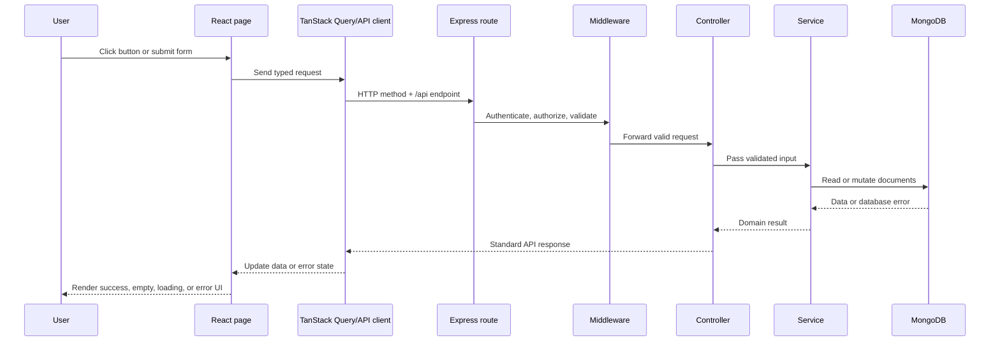

# Con.AI Construction Material Management User Tutorial

> A beginner-friendly, step-by-step guide to using the actual system correctly from setup through daily construction operations.

## 1. What This Project Does

Con.AI helps construction teams manage the complete material lifecycle:

```text
Project planning
      |
      v
Material catalog -> Suppliers -> Purchase orders -> Goods receipt
                                                   |
                                                   v
                                      Inventory and stock ledger
                                                   |
                         +-------------------------+-------------------------+
                         v                         v                         v
                   Site issue                  Returns                    Waste
                         |                         |                         |
                         +-------------------------+-------------------------+
                                                   v
                                  Planned vs actual consumption
                                                   |
                                                   v
                                  Dashboard and analytics
```

The project is useful for learning how a real business application is built because it combines:

- Authentication with JWT tokens
- Role-based access control
- REST APIs
- MongoDB data modeling
- Validation at the API boundary
- Transactional inventory updates
- React routing and protected pages
- TanStack Query for server state
- React Hook Form and Zod for forms
- Operational dashboards and analytics

The project is **not an AI feature yet**. Its audit records, consumption plans, waste records, and inventory history are structured so future AI features can be added without replacing the core data model.

## 2. How to Use the System

Use the system in this operational order:

```text
Create account or sign in
  |
  v
Create projects and define work sites
  |
  v
Register materials and suppliers
  |
  v
Create and approve purchase orders
  |
  v
Receive goods into inventory
  |
  +--> Issue material to work sites
  |
  +--> Return unused material
  |
  +--> Record waste incidents
  |
  v
Compare planned vs actual consumption
  |
  v
Review dashboard, analytics, and reports
```

This order matters. For example, inventory is created or increased by receiving goods through a purchase order. Creating an inventory screen does not replace the receiving workflow.

### The first five minutes

1. Open the home page at `/`.
2. Choose **Sign in** or **Create workspace**.
3. Use a seeded role account if the database has been seeded.
4. Open **Projects** and select the project scope in the sidebar.
5. Open **Materials** and confirm the catalog is available.
6. Open **Suppliers** and confirm suppliers are available.
7. Open **Purchase Orders** to create the first order.

### What each main page is for

| Page | Route | Use it when you need to |
|---|---|---|
| Home | `/` | Enter the system or choose registration/login |
| Login | `/login` | Sign in to an existing account |
| Register | `/register` | Create the first or a new organization account |
| Dashboard | `/dashboard` | See current operational health and alerts |
| Projects | `/projects` | Create sites, review status, and open a project hub |
| Materials | `/materials` | Maintain material names, units, categories, and reorder levels |
| Suppliers | `/suppliers` | Maintain supplier contacts, ratings, and material relationships |
| Purchase Orders | `/purchase-orders` | Request, approve, cancel, and receive materials |
| Inventory | `/inventory` | Review stock and issue or return materials |
| Transactions | `/inventory/transactions` | Audit every receive, issue, and return movement |
| Waste | `/waste` | Record lost, damaged, expired, or overused material |
| Planned vs Actual | `/consumption` | Compare budgeted consumption with actual usage |
| Analytics | `/analytics` | Review cost, ABC, SDE, and EOQ analysis for one project |
| Reports | `/reports` | Print a read-only operational summary |
| Users | `/users` | Admin-only role and account status management |

### Daily operator checklist

- [ ] Sign in and select the active project scope.
- [ ] Review Dashboard low-stock and pending-PO indicators.
- [ ] Review new or delayed Purchase Orders.
- [ ] Record goods received before issuing them to a site.
- [ ] Record every issue and return on the same day.
- [ ] Record waste with the correct reason and quantity.
- [ ] Review Transactions for unexpected stock changes.
- [ ] Review Planned vs Actual at the end of the reporting period.

### Weekly manager checklist

- [ ] Review active and on-hold projects.
- [ ] Approve valid draft purchase orders.
- [ ] Review low-stock materials and reorder needs.
- [ ] Review waste cost impact by project.
- [ ] Compare actual cost with planned cost.
- [ ] Review ABC, SDE, and EOQ results for procurement decisions.
- [ ] Print or share the Reports page.

### Role-based starting points

| Role | Start here | Main actions |
|---|---|---|
| Admin | Dashboard and Users | Everything, including roles and account status |
| Manager | Dashboard and Projects | Manage sites, suppliers, POs, plans, and analytics |
| Engineer | Projects and Waste | Create draft POs, plans, and waste records |
| Store keeper | Inventory and Purchase Orders | Receive, issue, return, and audit stock |
| Viewer | Dashboard and Reports | Read-only monitoring |

## 3.1 Role Permissions in Simple Terms

Use this table when deciding which account should perform an action during testing.

| Feature | Admin | Manager | Engineer | Store keeper | Viewer |
|---|---:|---:|---:|---:|---:|
| View dashboard | Yes | Yes | Yes | Yes | Yes |
| View projects | Yes | Yes | Yes | Yes | Yes |
| Create/update projects | Yes | Yes | No | No | No |
| View materials | Yes | Yes | Yes | Yes | Yes |
| Create/update materials | Yes | Yes | No | Yes | No |
| View suppliers | Yes | Yes | Yes | Yes | Yes |
| Create/update suppliers | Yes | Yes | No | No | No |
| Create purchase orders | Yes | Yes | Yes | No | No |
| Approve/cancel purchase orders | Yes | Yes | No | No | No |
| Receive purchase orders | Yes | Yes | No | Yes | No |
| Issue/return inventory | Yes | Yes | No | Yes | No |
| Create waste records | Yes | Yes | Yes | Yes | No |
| Create/update consumption plans | Yes | Yes | Yes | No | No |
| View analytics | Yes | Yes | Yes* | Yes* | No |
| Manage users and roles | Yes | No | No | No | No |

`Yes*` means the user can open the page, but analytics require a selected project and the backend may limit useful data by available records.

### What each role should do

#### Admin

- Create or manage users.
- Maintain projects, materials, and suppliers.
- Approve and receive purchase orders.
- Correct account status and roles.
- Review every dashboard, inventory, waste, plan, analytics, and report feature.

#### Manager

- Create projects and maintain budgets.
- Maintain materials and suppliers.
- Create, approve, and cancel purchase orders.
- Review or receive deliveries.
- Review inventory, waste, plans, analytics, and reports.

#### Engineer

- View project and material information.
- Create draft purchase orders.
- Create consumption plans and update actuals.
- Report waste incidents.
- Review project information and analytics.

#### Store keeper

- Maintain materials.
- Receive approved purchase orders.
- Issue material to projects.
- Return unused material.
- Review transaction history.
- Report waste incidents.

#### Viewer

- View dashboard, projects, materials, suppliers, and inventory.
- Read reports where available.
- Cannot create, edit, approve, receive, issue, return, or manage users.

## 3.2 Simple End-to-End Test

Run this test after starting MongoDB, the backend, and the frontend. Use a development database because the seed command clears existing seed collections.

### Test setup

```powershell
# Terminal 1
cd backend
npm install
npm run seed
npm run dev

# Terminal 2
cd frontend
npm install
npm run dev
```

Open `http://localhost:5173/`.

### Test 1: Home, registration, and login

1. Confirm the home page shows **Sign in** and **Create workspace**.
2. Open **Create workspace**.
3. Register a new user with a unique email.
4. Confirm the user is sent to the dashboard.
5. Sign out.
6. Sign in with the seeded admin account:

```text
Email: admin@example.com
Password: admin123
```

Pass condition: registration, login, dashboard redirect, and logout all work.

### Test 2: Admin setup

While logged in as admin:

1. Open **Projects** and create a project.
2. Open **Materials** and create a material.
3. Open **Suppliers** and create a supplier connected to that material.
4. Open **Users** and confirm the user list is visible.

Pass condition: all records save and appear in their lists.

### Test 3: Manager procurement flow

1. Sign out.
2. Sign in as:

```text
Email: manager@example.com
Password: admin123
```

3. Open **Purchase Orders**.
4. Create a draft PO using the project, supplier, and material from Test 2.
5. Approve the PO.
6. Open the PO detail page.

Pass condition: the PO is created as `draft`, then changes to `approved`.

### Test 4: Store keeper receiving flow

1. Sign out.
2. Sign in as:

```text
Email: store@example.com
Password: admin123
```

3. Open the approved PO.
4. Receive part of the ordered quantity.
5. Open **Inventory**.
6. Open **Transactions**.

Pass condition:

- PO becomes `partially_received`.
- Inventory stock increases by the received amount.
- A `RECEIVE` transaction appears.

Receive the remaining quantity and confirm the PO becomes `received`.

### Test 5: Inventory issue and return

While still logged in as store keeper:

1. Open **Inventory** and select **Issue**.
2. Issue a quantity lower than current stock.
3. Confirm stock decreases.
4. Confirm an `ISSUE` transaction appears.
5. Try to issue more than current stock.
6. Confirm the system rejects it with `Insufficient stock`.
7. Select **Return** and return a valid quantity.
8. Confirm stock increases and a `RETURN` transaction appears.

### Test 6: Engineer waste and planning flow

1. Sign out.
2. Sign in as:

```text
Email: engineer@example.com
Password: admin123
```

3. Open **Waste** and record a damaged-material incident.
4. Open **Planned vs Actual** and create a plan.
5. Update its actual quantity and actual unit cost.

Pass condition:

- Waste appears in the history with a backend-calculated cost impact.
- The plan shows planned and actual values.
- Variance values change after actuals are updated.

### Test 7: Viewer permission test

Create or use a viewer account, then verify:

1. Dashboard, Projects, Materials, Suppliers, and Inventory can be viewed.
2. Create/edit buttons are hidden or unavailable.
3. Direct unauthorized API actions return `403`.

Pass condition: viewer can read permitted data but cannot mutate business records.

### Test 8: Analytics and reports

1. Sign in as manager or admin.
2. Select a specific project in the sidebar project selector.
3. Open **Analytics**.
4. Check Cost, ABC, SDE, and EOQ tabs.
5. Open **Reports**.
6. Select **Print report**.

Pass condition: analytics load for a selected project and the report displays current dashboard/cost data.

### End-to-end test result sheet

| Test | Expected result | Pass |
|---|---|---|
| Home and navigation | Home, login, and register open | [ ] |
| Registration | New user is created and signed in | [ ] |
| Login/logout | Session starts and ends correctly | [ ] |
| Admin setup | Project, material, supplier, and user data work | [ ] |
| PO creation | Draft PO is created | [ ] |
| PO approval | Draft becomes approved | [ ] |
| Goods receipt | Inventory increases and RECEIVE is logged | [ ] |
| Partial receipt | Remaining quantity is calculated correctly | [ ] |
| Issue | Stock decreases and ISSUE is logged | [ ] |
| Negative/insufficient issue | Backend rejects invalid quantity | [ ] |
| Return | Stock increases and RETURN is logged | [ ] |
| Waste | Waste record and cost impact appear | [ ] |
| Consumption | Plan, actuals, and variance appear | [ ] |
| Analytics | Project analytics load | [ ] |
| Reports | Summary is accurate and printable | [ ] |
| RBAC | Viewer and unauthorized actions are blocked | [ ] |

If a test fails, record these three details before changing code:

1. The logged-in role.
2. The exact page or endpoint.
3. The browser Network response, including status code and message.

## 3.3 Core Feature Workflows

The following workflows describe how to use the actual screens properly. Complete them in order when setting up a new organization.

### Workflow A: Create an account and sign in

Use this when you do not have an account yet.

1. Open `/`.
2. Select **Create workspace**.
3. Enter your full name, work email, and a password with at least six characters.
4. Select **Create workspace**.
5. The system sends the registration request to the backend and signs you in automatically.
6. You should land on `/dashboard`.
7. If you already have an account, select **Sign in** instead.

Expected result:

- A successful registration creates a user and JWT.
- A deactivated account cannot sign in.
- Invalid credentials show an error without creating a session.
- Signing out removes the session from the browser.

### Workflow B: Set up a construction project

Use this before creating purchase orders or consumption plans.

1. Open **Projects**.
2. Select **Create New Project**. Admin and manager roles can create projects.
3. Enter a unique project code, name, location, budget, start date, and expected completion date.
4. Submit the form.
5. Open the new project hub.
6. Use **Set as Active Scope** from the project list when you want the sidebar and analytics to focus on that site.
7. Move status from `planning` to `active` when site work begins.
8. Use `on_hold` only when the project is temporarily paused.
9. Move to `completed` only when work is finished.

Rules:

- Expected completion must not be before the start date.
- Project codes are unique and immutable.
- Invalid status transitions are rejected by the backend.

### Workflow C: Register materials

1. Open **Materials**.
2. Select **Add material** if your role is admin, manager, or store keeper.
3. Enter the material name and unique code.
4. Select a category and measurement unit.
5. Set the reorder level. This is the threshold used for low-stock warnings.
6. Add an HSN code and description when available.
7. Save the material.
8. Use the search field or category filter to find it later.
9. Use **Deactivate** when the material should no longer be used in new purchase orders.

Do not delete a material in the UI unless a DELETE endpoint is explicitly implemented. The current workflow uses PATCH with `isActive` to deactivate or reactivate it.

### Workflow D: Register suppliers

1. Open **Suppliers**.
2. Select **Add supplier** as admin or manager.
3. Enter supplier code, company name, contact details, address, and rating.
4. Select the active materials this supplier provides.
5. Save the supplier.
6. Use the supplier search field to confirm the record.
7. Edit the supplier when contact details, rating, or supplied materials change.

The material multi-select stores real material IDs. Select materials from the list instead of typing IDs manually.

### Workflow E: Create, approve, and receive a purchase order

This is the most important operational workflow because receiving goods increases inventory.

#### Create the draft

1. Open **Purchase Orders**.
2. Select **Create purchase order**.
3. Choose a project and active supplier.
4. Add one or more material rows.
5. Set quantity and unit price for every row.
6. Set an expected delivery date.
7. Add notes if the supplier needs delivery instructions.
8. Select **Create draft purchase order**.

The backend calculates the total amount. A draft can be edited only while it remains a draft.

#### Approve or cancel

1. Review the draft details.
2. A manager or admin selects **Approve** when the order is valid.
3. A manager or admin selects **Cancel** when the order should not proceed.
4. Engineers can create draft orders but cannot approve them.

#### Receive goods

1. Open the purchase order detail page.
2. Compare ordered, previously received, and remaining quantities.
3. Enter the quantity received in the current delivery batch.
4. Select **Record goods receipt** as admin, manager, or store keeper.
5. Confirm that the PO status becomes `partially_received` or `received`.
6. Open **Inventory** and confirm stock increased.
7. Open **Transactions** and confirm a `RECEIVE` record exists.

Never receive more than the remaining quantity. The backend should remain the final authority even if a browser value is manipulated.

### Workflow F: Issue and return inventory

#### Issue material to a site

1. Open **Inventory**.
2. Select **Issue**.
3. Choose the project and material.
4. Enter the quantity and work note.
5. Submit the issue.
6. Confirm current stock decreases.
7. Confirm an `ISSUE` transaction appears in **Transactions**.

The issue fails with `Insufficient stock` when quantity is greater than current stock.

#### Return unused material

1. Open **Inventory**.
2. Select **Return**.
3. Choose project and material.
4. Enter the returned quantity and reason.
5. Submit the return.
6. Confirm current stock increases.
7. Confirm a `RETURN` transaction appears in the ledger.

### Workflow G: Record waste

1. Open **Waste**.
2. Select **Log waste incident**.
3. Select the project and material.
4. Enter a positive quantity.
5. Select the reason: damaged, expired, spillage, defective, overuse, natural loss, or other.
6. Add the incident date and description.
7. Submit the record.
8. Review cost impact after the backend calculates it from purchase history.

Use a separate record for each incident when the reasons or dates are different.

### Workflow H: Plan and measure consumption

1. Open **Planned vs Actual**.
2. Select **New plan**.
3. Choose project and material.
4. Enter a period such as `2026-Q4` or `2026-09`.
5. Enter planned quantity and planned unit cost.
6. Save the plan.
7. At the end of the period, select **Update actuals**.
8. Enter actual quantity and actual unit cost.
9. Compare planned and actual costs.
10. Use the report endpoint or Reports page for the project summary.

The same project, material, and period cannot have duplicate plans.

### Workflow I: Read analytics correctly

1. Select one project in the sidebar scope selector.
2. Open **Analytics**.
3. Review **Cost analysis** for ordered cost, issued quantity, waste, and waste rate.
4. Review **ABC analysis** to identify high-value consumption materials.
5. Review **SDE analysis** to identify scarcity and procurement difficulty.
6. Review **EOQ** for ordering and holding-cost decisions.

Analytics require a specific project. If the scope is **All Projects**, select a project before expecting project analytics.

### Workflow J: Review the dashboard and reports

1. Open **Dashboard** after selecting a project or All Projects.
2. Review active projects, stock value, low-stock count, pending POs, waste cost, and cost variance.
3. Open low-stock items in Inventory.
4. Open pending POs in Purchase Orders.
5. Open **Reports** for a read-only summary.
6. Select **Print report** to use the browser print dialog.

Reports are composed from existing dashboard and analytics APIs. They do not create a second reporting database.

---

## 4. What You Will Learn

By completing this tutorial, you will understand how to:

- Start a TypeScript Express backend and React frontend
- Trace a button click from React to MongoDB and back
- Design a Mongoose model and service layer
- Protect a route with authentication and roles
- Validate requests with Zod
- Build a React page from an API contract
- Handle loading, empty, success, and error states
- Update server data and invalidate React Query caches
- Test business rules such as insufficient stock
- Add a new module without mixing UI, API, and database responsibilities

Use the checkboxes as a learning tracker:

- [ ] I can start MongoDB
- [ ] I can start the backend
- [ ] I can start the frontend
- [ ] I can log in with a seeded account
- [ ] I can explain the request flow
- [ ] I can create a project
- [ ] I can create a purchase order
- [ ] I can receive material into inventory
- [ ] I can issue, return, and record waste
- [ ] I can explain a dashboard number using backend code

---

## 5. Repository Map

```text
material-management/
├── backend/
│   ├── src/
│   │   ├── config/          Environment, constants, database connection
│   │   ├── controllers/     HTTP request and response handlers
│   │   ├── middleware/      Auth, roles, validation, errors, rate limits
│   │   ├── models/          Mongoose schemas
│   │   ├── routes/          HTTP endpoint definitions
│   │   ├── scripts/         Seed data
│   │   ├── services/        Business rules and database operations
│   │   ├── types/           Express type extensions
│   │   ├── utils/           JWT, passwords, API responses, pagination
│   │   └── validators/      Zod request schemas
│   ├── .env
│   └── package.json
├── frontend/
│   ├── src/
│   │   ├── components/      Shared UI and layout
│   │   ├── context/         Auth and project scope state
│   │   ├── pages/           Route-level screens
│   │   ├── services/        Frontend API client
│   │   ├── types/           Shared frontend data shapes
│   │   └── App.tsx          Routes and access boundaries
│   └── package.json
├── README.md
├── uineed.txt              UI requirements and page specification
└── tutorial.md             This tutorial
```

A useful rule is:

> Routes decide which endpoint exists. Controllers translate HTTP. Services own business rules. Models own persistence. Pages render data and call API hooks.

---

## 6. Prerequisites

Install:

- Node.js 18 or newer
- npm
- MongoDB locally, or a MongoDB Atlas connection string
- VS Code recommended

Check Node and npm:

```powershell
node --version
npm --version
```

Check MongoDB according to your installation method. A local MongoDB server normally uses:

```text
mongodb://localhost:27017/material-management
```

---

## 7. Configure the Backend

Open a terminal at the repository root:

```powershell
cd backend
npm install
```

Create `backend/.env` using the values required by `backend/src/config/env.ts`:

```env
NODE_ENV=development
PORT=5000
MONGO_URI=mongodb://localhost:27017/material-management
JWT_SECRET=replace-with-at-least-32-characters
JWT_EXPIRES_IN=7d
BCRYPT_SALT_ROUNDS=12
CORS_ORIGIN=http://localhost:5173,http://127.0.0.1:5173
```

Important:

- Never commit real secrets.
- `JWT_SECRET` must be at least 32 characters.
- `CORS_ORIGIN` must include the URL used by Vite.

Build the backend:

```powershell
npm run build
```

Start it in development mode:

```powershell
npm run dev
```

Expected server URL:

```text
http://localhost:5000
```

Verify the health endpoint in another terminal:

```powershell
Invoke-WebRequest http://localhost:5000/api/health -UseBasicParsing
```

Expected result includes:

```json
{
  "status": "ok",
  "dbStatus": "connected"
}
```

---

## 8. Seed Beginner Data

The seed script creates users, projects, materials, and suppliers:

```powershell
cd backend
npm run seed
```

Warning: the seed script deletes existing users, projects, materials, and suppliers before inserting demo data. Use it only in a development database.

Seed accounts:

| Role | Email | Password |
|---|---|---|
| Admin | `admin@example.com` | `admin123` |
| Manager | `manager@example.com` | `admin123` |
| Store keeper | `store@example.com` | `admin123` |
| Engineer | `engineer@example.com` | `admin123` |

The seed script currently creates four users. A viewer account can be created through registration or directly in a development database.

---

## 9. Start the Frontend

Open a second terminal at the repository root:

```powershell
cd frontend
npm install
npm run dev
```

Open:

```text
http://localhost:5173/
```

The public flow is:

```text
/          Home page
/login     Existing user login
/register  New account registration
/dashboard Authenticated application
```

The frontend Vite proxy sends `/api/*` requests to `http://localhost:5000`.

Build the frontend:

```powershell
npm run build
```

Run frontend lint:

```powershell
npm run lint
```

---

## 10. First User Journey

Follow this path in the browser:

1. Open `/`.
2. Select **Create workspace**.
3. Register with a name, email, and password of at least six characters.
4. Confirm that registration automatically opens the dashboard.
5. Sign out from the authenticated layout.
6. Return to `/login`.
7. Sign in with the account you created or a seeded account.
8. Refresh the page and confirm the session is verified with `/api/auth/me`.
9. Sign out again and confirm protected routes redirect to `/login`.

Checkpoint:

- [ ] Home page opens without a token
- [ ] Registration calls the backend
- [ ] Login stores a JWT
- [ ] Refresh keeps the session when Remember me is selected
- [ ] Logout removes local and session storage
- [ ] Invalid tokens are cleared after `/auth/me` fails

---

## 11. The Full Request Flow

Every feature follows this path:



For example, receiving goods uses:

```text
PurchaseOrderDetailPage
  -> POST /api/purchase-orders/:id/receive
  -> purchaseOrder.routes.ts
  -> authenticate + requireStoreKeeper + receiveGoodsSchema
  -> purchaseOrder.controller.ts
  -> purchaseOrder.service.ts
  -> inventory.service.receiveMaterial()
  -> Inventory + InventoryTransaction documents
  -> response with updated purchase order
  -> React Query invalidates purchase order and inventory queries
```

When debugging, inspect the layers in this order:

1. Browser Network tab
2. Frontend API client
3. Route middleware
4. Controller
5. Service
6. Model and database
7. Response adapter in the page

---

## 12. Authentication and Roles

The backend signs a JWT after login or registration. The frontend sends it as:

```http
Authorization: Bearer <token>
```

Roles:

| Role | Main responsibility |
|---|---|
| `admin` | Full access and user management |
| `manager` | Projects, suppliers, POs, plans, analytics |
| `engineer` | Draft POs, waste, consumption plans, project work |
| `store_keeper` | Receiving, issuing, returning, waste, stock ledger |
| `viewer` | Read-only operational access |

Backend role middleware:

- `requireAdmin`
- `requireManager`
- `requireStoreKeeper`
- `requirePlanner`
- `requireWasteReporter`

Frontend role checks are for usability only. The backend remains the security boundary. Never rely on hiding a button as authorization.

Try this exercise:

1. Log in as `viewer`.
2. Open Materials and confirm reading works.
3. Try to create a material through the UI or API.
4. Confirm the backend returns `403 Insufficient permissions`.

---

## 13. Build the Modules in This Order

### Step 1: Authentication

Read:

- `backend/src/routes/auth.routes.ts`
- `backend/src/validators/auth.validator.ts`
- `backend/src/services/auth.service.ts`
- `frontend/src/context/AuthContext.tsx`
- `frontend/src/pages/auth/LoginPage.tsx`
- `frontend/src/pages/auth/RegisterPage.tsx`

Practice:

- Add a password visibility toggle.
- Add a test for invalid login payloads.
- Trace where tokens are stored and removed.

### Step 2: Projects

Backend endpoints:

```text
GET   /api/projects
POST  /api/projects
GET   /api/projects/:id
PATCH /api/projects/:id
```

The project status state machine is:

```text
planning -> active
active -> on_hold
active -> completed
on_hold -> active
```

Read:

- `backend/src/models/Project.model.ts`
- `backend/src/services/project.service.ts`
- `frontend/src/pages/projects/ProjectsPage.tsx`
- `frontend/src/pages/projects/ProjectDetailPage.tsx`

Practice:

- Create a planning project.
- Move it to active.
- Try an invalid transition and inspect the error.

### Step 3: Materials

Backend endpoints:

```text
GET   /api/materials
POST  /api/materials
GET   /api/materials/:id
PATCH /api/materials/:id
```

The current implementation uses PATCH with `isActive` for deactivation/reactivation. Do not assume a DELETE endpoint exists unless you add and test one in the backend.

Practice:

- Filter by category.
- Create a material.
- Change its reorder level.
- Deactivate it and confirm it cannot be added to new purchase orders.

### Step 4: Suppliers

Backend endpoints:

```text
GET   /api/suppliers
POST  /api/suppliers
GET   /api/suppliers/:id
PATCH /api/suppliers/:id
```

Supplier material relationships store Material ObjectIds. The frontend must use IDs from `/api/materials`, not material names.

Practice:

- Create a supplier.
- Associate it with active materials.
- Search for the supplier.
- Update its rating.

### Step 5: Purchase Orders

Backend endpoints:

```text
GET   /api/purchase-orders
POST  /api/purchase-orders
GET   /api/purchase-orders/:id
PATCH /api/purchase-orders/:id
PATCH /api/purchase-orders/:id/approve
PATCH /api/purchase-orders/:id/cancel
POST  /api/purchase-orders/:id/receive
```

Purchase order lifecycle:

```text
draft -> approved -> partially_received -> received
   \-> cancelled
```

The backend calculates `totalAmount` from quantity multiplied by unit price. The frontend should preview totals, but the server is authoritative.

Practice:

1. Create a draft PO.
2. Approve it as manager/admin.
3. Receive part of the goods as store keeper.
4. Confirm inventory increases.
5. Receive the remainder.
6. Confirm the PO becomes received.

### Step 6: Inventory

Backend endpoints:

```text
GET  /api/inventory
GET  /api/inventory/:id
POST /api/inventory/issue
POST /api/inventory/return
GET  /api/inventory/transactions
```

Important business rules:

- Issue quantity must not exceed current stock.
- Inventory updates and transaction records are written together in a Mongoose transaction.
- Receiving a PO creates a `RECEIVE` transaction.
- Issuing creates an `ISSUE` transaction.
- Returning creates a `RETURN` transaction.

Practice:

- Issue a quantity greater than stock and confirm `Insufficient stock`.
- Issue a valid quantity and check `balanceAfter`.
- Return material and verify stock increases.

### Step 7: Waste

Backend endpoints:

```text
GET  /api/waste
POST /api/waste
GET  /api/waste/:id
```

Waste cost impact is calculated by the backend from average approved/received purchase prices. The client should not invent a cost value.

Practice:

- Record damaged material.
- Record spillage.
- Compare quantity and cost impact in the list.

### Step 8: Consumption Plans

Backend endpoints:

```text
GET   /api/consumption-plans
POST  /api/consumption-plans
GET   /api/consumption-plans/:id
PATCH /api/consumption-plans/:id
GET   /api/consumption-plans/:id/variance
GET   /api/consumption-plans/report
```

The unique business key is:

```text
projectId + materialId + period
```

Variance formulas used by the backend:

```text
quantityVariance = actualQuantity - plannedQuantity
plannedCost      = plannedQuantity * plannedUnitCost
actualCost       = actualQuantity * actualUnitCost
costVariance     = actualCost - plannedCost
```

Practice:

- Create a plan.
- Update actual quantity and unit cost.
- Open the variance endpoint.
- Compare the API result with manual calculations.

### Step 9: Analytics

All analytics endpoints require a specific `projectId`:

```text
GET /api/analytics/cost?projectId=...
GET /api/analytics/abc?projectId=...
GET /api/analytics/sde?projectId=...
GET /api/analytics/eoq?projectId=...
```

Analytics are read models built from existing procurement, inventory, waste, and material data. They do not create new operational records.

### Step 10: Reports

There is no separate backend reports controller. The frontend Reports page composes existing responses from:

- `/api/dashboard/summary`
- `/api/analytics/cost`
- Project-scoped data where selected

This is a useful pattern: a report can be a read-only composition of authoritative APIs instead of a duplicate database model.

---

## 14. API Response Format

Successful response:

```json
{
  "success": true,
  "statusCode": 200,
  "message": "Materials retrieved successfully",
  "data": [],
  "meta": {
    "page": 1,
    "limit": 20,
    "total": 0,
    "totalPages": 0
  }
}
```

Paginated list data uses a resource-specific property in the backend service response before it is placed in `data`, for example:

- `projects`
- `materials`
- `suppliers`
- `purchaseOrders`
- `inventory`
- `wasteRecords`
- `consumptionPlans`

When a page renders empty data unexpectedly, inspect whether it expects an array while the API returns an object containing the resource list.

Error response:

```json
{
  "success": false,
  "statusCode": 400,
  "message": "Validation failed",
  "errors": [
    { "field": "email", "message": "Invalid email format" }
  ]
}
```

---

## 15. How to Add a New Feature

Use this repeatable workflow.

### A. Define the business rule

Write one sentence:

> A store keeper can receive approved purchase-order items, and receiving increases site stock.

### B. Define the data shape

Decide which fields are required, optional, unique, and immutable.

### C. Add or update the model

Create the Mongoose schema in `backend/src/models/`.

### D. Add a validator

Create a Zod schema in `backend/src/validators/`.

### E. Add the service

Put calculations, permissions-independent business rules, and transactions in `backend/src/services/`.

### F. Add the controller

The controller should read request values, call the service, and return `ApiResponse.success`.

### G. Add the route

Attach authentication, authorization, validation, and the controller in that order:

```ts
router.post(
  '/',
  authenticate,
  requireStoreKeeper,
  validateBody(receiveGoodsSchema),
  asyncHandler(controller.receive)
);
```

### H. Add frontend types and API access

Use the real endpoint and real response shape. Do not add mock fallback records.

### I. Build the page states

Every page should handle:

- Loading
- Success with data
- Success with no data
- Validation error
- Authorization error
- Network/server error

### J. Invalidate related queries

After mutations, invalidate all affected data. For receiving goods, invalidate at least:

```text
purchase-order detail
purchase-order list
inventory
inventory transactions
```

### K. Test the business rule

Test both the happy path and the rule violation.

---

## 16. Beginner Debugging Guide

### The page is blank

1. Open the browser console.
2. Check the terminal running Vite.
3. Run `npm run build` in `frontend`.
4. Check that the route is nested under the authenticated layout when required.
5. Check that all required React providers exist in `main.tsx`.

### The page says no data, but MongoDB has data

1. Open the Network tab.
2. Inspect the JSON response.
3. Check whether `data` is an array or an object.
4. Check populated field names such as `projectId` versus `project`.
5. Check that the JWT Authorization header is present.

### Login loops back to the login page

1. Check `/api/auth/login` status.
2. Check whether `token` exists in local or session storage.
3. Check `/api/auth/me`.
4. Check that the frontend is calling `/api`, not `http://localhost:5000` directly.
5. Check CORS and the Vite proxy.

### A mutation returns 403

1. Confirm the logged-in role.
2. Read the matching backend route middleware.
3. Check whether the frontend button visibility matches backend permission.
4. Remember that backend permission is authoritative.

### Inventory numbers are wrong

Trace:

```text
PurchaseOrder.receive()
  -> receiveMaterial()
  -> Inventory.currentStock
  -> InventoryTransaction.balanceAfter
```

Never fix a stock number only in React state. Fix the service transaction or refetch authoritative data.

---

## 17. Verification Checklist Before Calling a Module Complete

For each module, confirm:

- [ ] Backend route exists
- [ ] HTTP method matches the frontend
- [ ] Request body matches the Zod validator
- [ ] Auth header is sent
- [ ] Role is correct
- [ ] Response envelope is unwrapped correctly
- [ ] Populated references are normalized
- [ ] Loading state exists
- [ ] Empty state exists
- [ ] Error state exists
- [ ] Success feedback exists
- [ ] React Query cache is invalidated after mutations
- [ ] Invalid IDs return an error
- [ ] Duplicate records are rejected where required
- [ ] Zero and negative quantities are rejected
- [ ] Large values do not break the UI
- [ ] Tables scroll on narrow screens
- [ ] `npm run build` passes

---

## 18. Useful Commands

From the repository root:

```powershell
# Backend
cd backend
npm install
npm run build
npm run dev
npm run seed
npm start

# Frontend, in another terminal
cd frontend
npm install
npm run dev
npm run build
npm run lint
```

Useful API checks:

```powershell
# Health
Invoke-WebRequest http://localhost:5000/api/health -UseBasicParsing

# Protected route without a token; should return 401
Invoke-WebRequest http://localhost:5000/api/projects -UseBasicParsing
```

---

## 19. Known Implementation Notes

These notes describe the current repository, not an idealized future API:

- Project listing currently validates `page`, `limit`, and `status`; frontend text search is local unless the backend query schema is expanded.
- Material and supplier deactivation is implemented through PATCH with `isActive`; do not assume DELETE routes exist.
- Purchase-order state actions use `/approve`, `/cancel`, and `/receive` routes.
- Inventory transactions are available at `/api/inventory/transactions`.
- Analytics endpoints require a selected project.
- Reports are composed in the frontend from existing APIs.
- Backend test scripts are not yet configured; `npm test` currently reports that no tests are specified.
- The seed script is destructive for selected collections and should never run against production data.

---

## 20. Final Learning Challenge

Build one small improvement without copying an existing page:

> Add a project status history panel that explains when a project moved from one status to another.

Before coding, answer:

1. Which backend model owns the history?
2. Is a new database collection needed?
3. Which role can create a transition?
4. Which API response should contain the history?
5. How will the frontend handle an empty history?
6. Which existing page and component patterns should be reused?
7. How will you test an invalid transition?

When you can answer those questions, you are no longer just assembling screens. You are designing a maintainable full-stack system.
